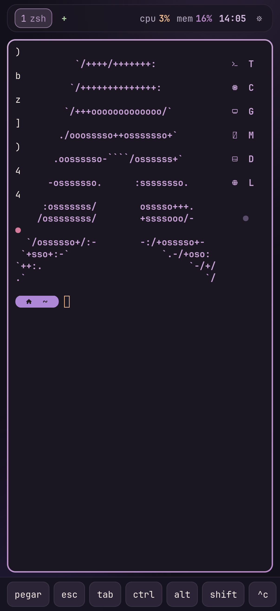

# hyprterm

La terminal de tu ordenador en el móvil — una PWA self-hosted sobre tmux, con
estética inspirada en Hyprland. Sin App Store, sin cuenta de Apple Developer, sin
nube.

```
iPhone (PWA instalada) ──wss──► Tailscale ──► tu máquina: hyprterm-server ──► tmux
```



- **Persistente** — las ventanas son ventanas de tmux; sobreviven a desconexiones
  y reinicios del *móvil*. Bloquea la app y tus shells siguen corriendo.
- **Multi-ventana** — desliza entre terminales, crea con `+`, cierra con `✕`,
  renombra con una pulsación larga.
- **Multi-host** — añade otras máquinas de tu tailnet (cada una con su
  hyprterm-server) y cambia entre ellas desde ajustes; cada una con su contraseña.
- **Temas** — Sakura, Catppuccin, Gruvbox, Nord, Tokyo Night, y los tuyos.
- **Waybar** — workspaces, CPU, memoria, batería y reloj (respeta la isla del iPhone).
- **Barra de teclas** — esc, tab, ctrl/alt/shift pegajosos, flechas, símbolos, pegar.
- **Seguro por defecto** — solo accesible dentro de tu tailnet, contraseña con
  scrypt, tokens firmados de vida corta, tickets de un solo uso para el WebSocket,
  y el server escucha solo en loopback salvo que lo cambies.

> Planificado: ver [ROADMAP.md](ROADMAP.md). · English: [README.md](README.md).

## Requisitos

- Una máquina para el server: **Linux** (systemd) o **macOS** (launchd), con
  **Node 18+**, **[pnpm](https://pnpm.io)** y **tmux**.
- **[Tailscale](https://tailscale.com)** (gratis) para el HTTPS que iOS exige —
  alternativas en [Sin Tailscale](#sin-tailscale).
- Un iPhone/iPad (o cualquier navegador) como cliente.

## Inicio rápido

```bash
git clone https://github.com/hxst1/Hyprterm ~/hyprterm
cd ~/hyprterm
./setup.sh          # pide contraseña/puerto, compila e instala el servicio
```

El instalador detecta tu SO, instala el servicio (systemd en Linux, LaunchAgent
en macOS), compila la PWA y lo arranca todo. Luego exponlo por HTTPS para que iOS
te deje instalar la PWA:

```bash
tailscale serve --bg 7705        # → https://<tu-host>.<tu-tailnet>.ts.net
```

En el iPhone: instala la app **Tailscale** y entra, abre la URL en Safari, y
**Compartir → Añadir a pantalla de inicio**. Listo, funciona como una app nativa.

> ¿Primera vez con Tailscale? Activa **HTTPS** y **MagicDNS** en la
> [página DNS del admin](https://login.tailscale.com/admin/dns), y ejecuta
> `sudo tailscale set --operator=$USER` una vez para que `tailscale serve` no pida sudo.

## Sin Tailscale

iOS solo deja *instalar* una PWA desde un origen con HTTPS **de confianza**. Un
certificado autofirmado de LAN no vale (iOS lo rechaza para instalar la PWA).
Opciones:

- **Tailscale** (recomendado) — gratis, da a cada máquina un certificado válido,
  sin abrir puertos ni tocar DNS. Es lo que asumen estos docs.
- **Tu propio dominio + reverse proxy** — apunta un subdominio a la máquina y pon
  Caddy/nginx con un certificado Let's Encrypt delante de `localhost:7705`. Suele
  implicar exponer un puerto a internet; si lo haces, contraseña fuerte y
  considera lista blanca de IPs.
- **Cloudflare Tunnel** (con Access) — otra opción zero-trust con HTTPS de
  confianza sin abrir puertos.
- **Navegadores de escritorio** no necesitan nada de esto: abre
  `http://<host>:7705` directamente (el HTTPS solo hace falta para instalar la
  PWA en iOS).

Si pones el server en una interfaz no-loopback (`"bind": "0.0.0.0"` en
`server/config.json`), avisa al arrancar — expone shells, así que pon un firewall
delante.

## Instalación manual

```bash
pnpm install                 # workspace: server + app
pnpm setpass <contraseña>    # escribe server/config.json (en .gitignore)
pnpm build                   # compila la PWA en app/dist
pnpm start                   # o instala el servicio desde deploy/
```

Plantillas de servicio en `deploy/` (`hyprterm.service` para systemd,
`com.hyprterm.server.plist` para launchd).

## Multi-host

Cada máquina corre su propio `hyprterm-server` autónomo — no hay hub central. En
la app, **ajustes (⚙) → hosts → + añadir host** e introduce la URL de la otra
máquina (p. ej. `mac.tu-tailnet.ts.net`). La lista muestra el estado
online/offline de cada host y tocas para cambiarte; cada uno con su contraseña.
La PWA instalada se queda en un origen y habla con los demás por CORS.

## Configuración

`server/config.json` (lo crea `setpass`, en .gitignore). Ver
`server/config.example.json` para todos los campos: `port`, `bind`, `session` de
tmux, `shell`, `startDir` (dónde nacen las ventanas) y `tokenTtlMs`. Los temas
propios van en `~/.config/hyprterm/themes/*.json`.

## Desarrollo

Ver [CONTRIBUTING.md](CONTRIBUTING.md) para el setup de desarrollo, los tests
(`pnpm test`) y notas de arquitectura.

## Licencia

MIT — ver [LICENSE](LICENSE).
